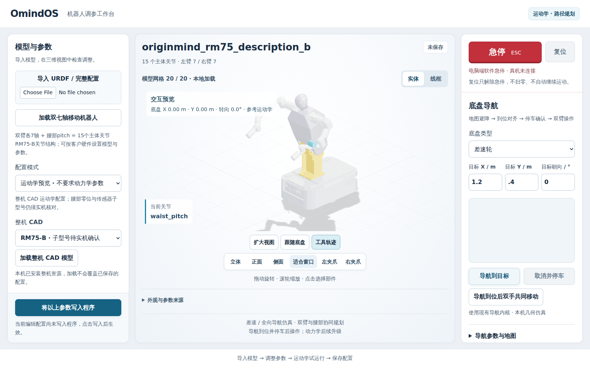

# OmindOS Manipulation · 移动双臂工作台

面向**双臂、腰部与轮式底盘**的一体化工作台。导入客户模型和参数，在同一界面完成三维预览、路径规划，以及导航到位后的双臂协同操作。

## 下载 Ubuntu 安装包

**约 88 MB · 0.3.1 正式版 · Ubuntu 22.04 / 24.04 · Intel / AMD 64 位电脑**

完整 RM75 整机 CAD、三维工作台、双臂与腰部规划算法、差速与全向底盘导航，以及运行依赖已经包含在包内。**只下载这一份，无需再下载工作台或独立算法包，也无需另装 Python、ROS、Node.js 或 Docker。**

### [下载 Ubuntu 安装包 →](https://github.com/maganrobotics-boop/OmindOS-Manipulation-Release/releases/download/v0.3.1/omindos-workbench-0.3.1-linux-x64.tar.gz)

[安装与首次使用指南 →](docs/GET_STARTED.zh-CN.md)

## 装好后能做什么？

- **整机 CAD 与调参**：直接加载 RM75-B / 6FB / 6F 完整模型，也可导入自己的 URDF，修改关节、连杆和工具坐标，保存版本或导出配置。
- **双臂与腰部规划**：规划关节路径和双手共同位移，保持两手相对位姿，进行保守离散碰撞检查。
- **底盘导航**：选择差速轮或全向轮，设置地图、目标位置和朝向，查看避障路径与停车状态。
- **移动后操作**：先导航、对齐并确认停车，再执行双臂任务；夹爪支持独立开合预览。

本版正式发行的验收范围是**本机运动学、路径规划与几何仿真**。动力学、真实传感器定位和真机驱动后续升级。

## 工作台长什么样？

**左侧导入模型和改参数，中间看三维机器人，右侧导航、规划和软件停止。** 图为 0.3.1 安装候选包的完整 CAD 验收截图，展示实际 RM75-B 整机、双七轴机械臂、共享腰关节与轮式底盘；正式包使用相同的程序、前端和模型文件。客户可以替换自己的模型和参数。

## 自己的参数怎么改？

1. **加载模型**：左侧“整机 CAD”选择子型号并加载，或导入自己的 URDF / 完整配置文件。
2. **编辑参数**：选择关节或连杆，填写尺寸、轴向、关节限位和工具坐标。
3. **写入并保存**：点击“将以上参数写入程序”，再保存版本或导出备份。
4. **设置任务**：在“客户规划配置”设置腰关节、双臂与 TCP 映射；在“底盘导航”和“导航参数与地图”设置底盘类型、地图及速度。

[查看图文操作指南 →](docs/WORKBENCH_USAGE.zh-CN.md)

## 需要登录吗？可以调用 API 吗？

**当前本地工作台无需注册或登录，可离线运行。** 启动后在浏览器打开 `http://127.0.0.1:8085/`，客户配置保存在本机。

开发者可以用自己的程序调用**同一安装包提供的本机 API**，读取和保存参数、提交规划、执行导航仿真。不必再安装独立算法包；界面可以不打开，工作台程序须保持运行。[API 使用指南 →](releases/v0.3.1/API.zh-CN.md)

## 更多资料

[导航与地图配置](releases/v0.3.1/NAVIGATION.zh-CN.md) · [规划与碰撞检查范围](releases/v0.3.1/PLANNING.zh-CN.md) · [历史版本](HISTORY.zh-CN.md) · [下载、校验与常见问题](docs/DOWNLOAD_HELP.zh-CN.md)

后续主机端开发与交付以 **Ubuntu** 为主，Windows 后续安排。
