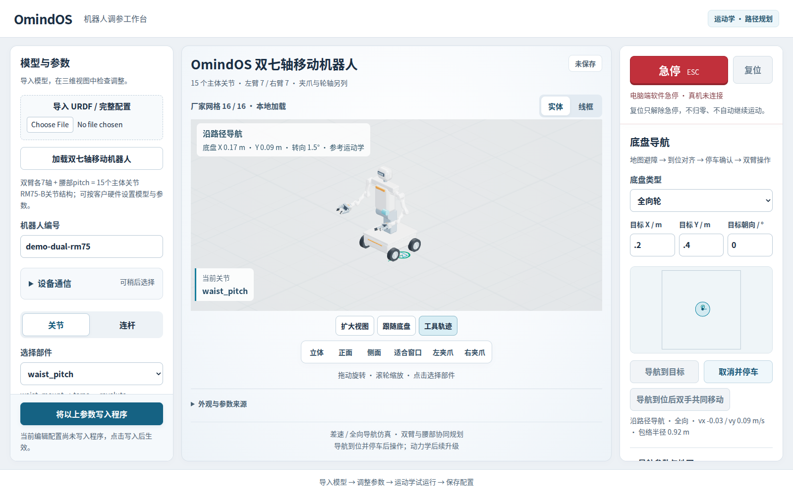

# 安装与首次使用

[返回首页](../README.md)

## 只下载一个文件

[下载 Ubuntu 0.3.0 完整安装包](https://github.com/maganrobotics-boop/OmindOS-Manipulation-Release/releases/download/v0.3.0/omindos-workbench-0.3.0-linux-x64.tar.gz)

适用 Ubuntu 22.04、Intel / AMD 64 位电脑，文件约 85 MB。包内包含三维工作台、双臂与腰部规划、两种底盘导航、模型和运行依赖。无需另装 Python、ROS、Node.js 或 Docker。

## 解压并启动

下载后完整解压，在解压目录打开终端运行 `./OmindOS-Workbench`。也可以在下载目录执行：

```bash
tar -xzf omindos-workbench-0.3.0-linux-x64.tar.gz
cd omindos-workbench-0.3.0-linux-x64
./OmindOS-Workbench
```

程序会自动打开本机浏览器。浏览器未自动打开时，访问：

```text
http://127.0.0.1:8085/
```

无需注册或登录。保持终端中的工作台程序运行；不要把可执行文件单独移出解压目录。



## 第一次使用

1. 在左侧加载随包双七轴移动机器人，或导入客户 URDF / 完整配置。
2. 检查模型、尺寸、关节轴向、限位及工具坐标。
3. 点击“将以上参数写入程序”，保存版本；可导出一份配置备份。
4. 先查看关节点动和三维预览，再按任务需要使用双臂规划或底盘导航。

[客户参数与任务设置](WORKBENCH_USAGE.zh-CN.md)

本版完成本机运动学、路径规划和几何仿真验收。当前导航位姿来自几何仿真，尚不连接真实电机或传感器定位；动力学后续升级。

## 开发者使用

同一程序提供本机 HTTP JSON API。无需打开界面时：

```bash
./OmindOS-Workbench --no-browser
```

[API 使用指南与客户程序示例](../releases/v0.3.0/API.zh-CN.md)

遇到下载、校验或启动问题，查看[常见问题](DOWNLOAD_HELP.zh-CN.md)。
